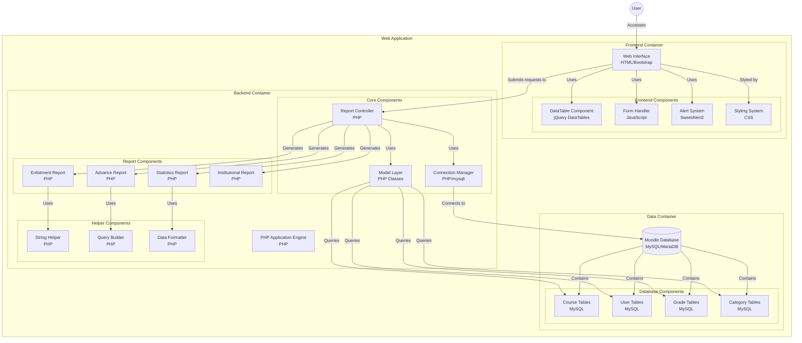

# Informes
Informe técnico de los cursos en la plataforma Moodle.

En este repositorio encontraras el aplicativo desarrollado por el departamento UNIAJCVirtual, el cual permite realizar 4 tipos de informes a la plataforma Moodle los cuales son: 

Alistamiento: Consiste en realizar ciertas configuraciones de tu curso en la plataforma Moodle, siguiendo las estructuras planteadas por la institución; dichas estructuras cuentan de cuatro aspectos importantes: Información del profesor, foro de consultas, fechas de las unidades y libro de calificaciones, cada uno de estos aspectos cuenta con un item especifico queda como resultado: CUMPLE, NO CUMPLE o NO APLICA.

Avance formativo 1 y 2 : Consiste en revisar las categorías del libro de calificaciones con los nombres "Avance formativo 1" y "Avance formativo 2"; revisar si las actividades, foros o cuestionarios tienen calificaciones y retroalimentaciones.

Estadísticas: Nos brinda la información de la cantidad de estudiantes y profesores en los diferentes cursos en la plataforma Moodle.

